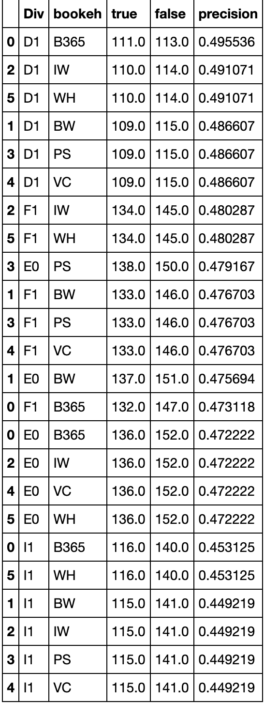
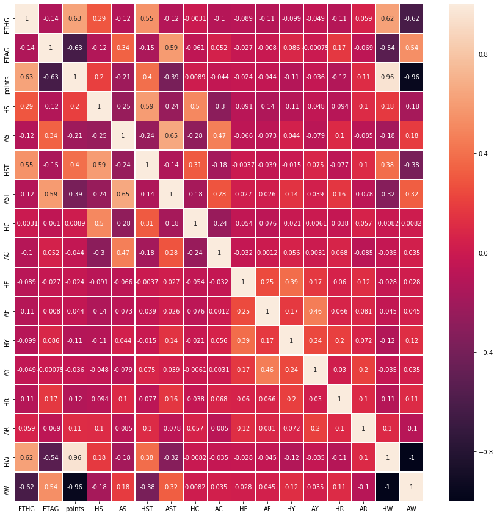
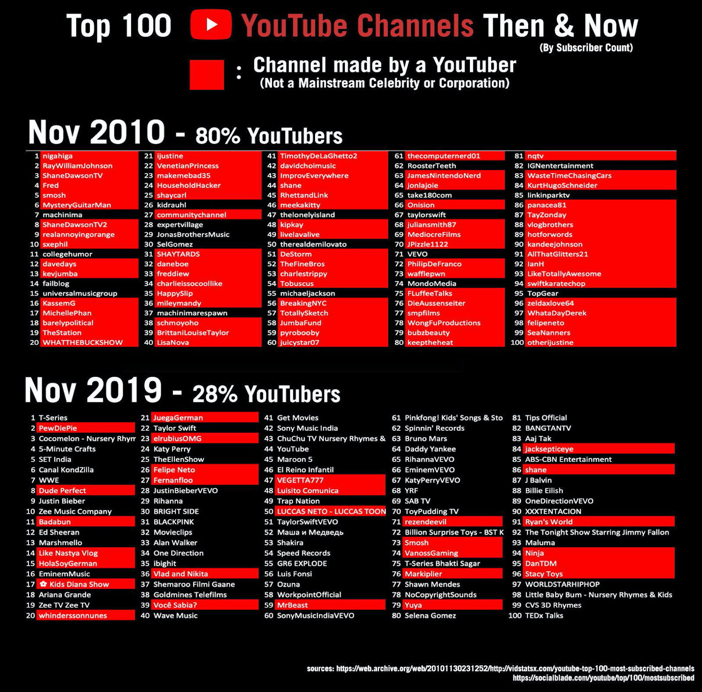
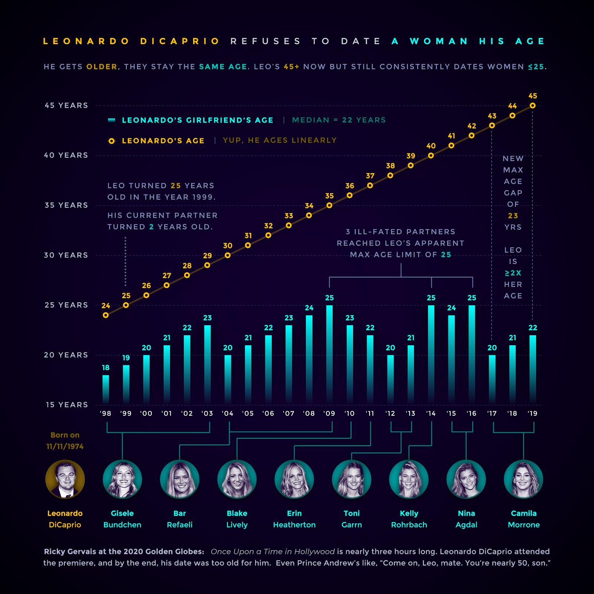
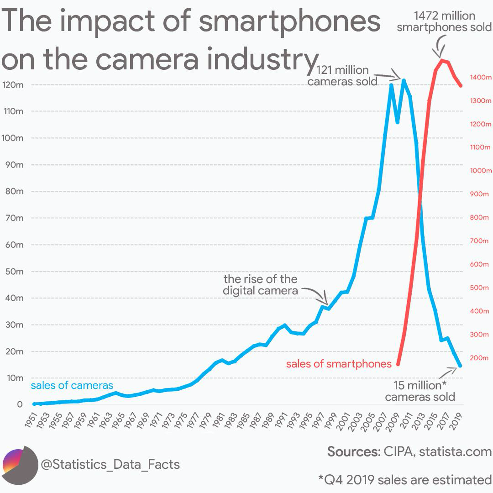

# Project of Data Visualization (COM-480)

| Student's name | SCIPER |
| -------------- | ------ |
| Georgios Fotiadis | 271875 |
| Gerald Sula | 257396 |
| Florian Genilloud | 271121 |

[Milestone 1](#milestone-1-friday-3rd-april-5pm) • [Milestone 2](#milestone-2-friday-1st-may-5pm) • [Milestone 3](#milestone-3-thursday-28th-may-5pm)

## Milestone 1 (Friday 3rd April, 5pm)
### Datasets

1. [First dataset](https://www.kaggle.com/martj42/international-football-results-from-1872-to-2017)
2. [Second dataset](https://www.football-data.co.uk/data.php)
3. [Third dataset](https://www.kaggle.com/hugomathien/soccer)

The datasets seem very clean and contain complementary information for one another. The two datasets from Kaggle have a very high usability score and manual data exploratory analysis in the first data sets yields similar results concerning its cleanliness and usability. After looking at them more deeply, they seem to have all we need to have some relevant statistics. In addition, It could be great to find a last one about match scorers and the exact time of the goal.

### Problematique

In this project we will focus on two things: first we will create visualizations regarding general statistics and trends of world football and then we will focus on betting in the context of football. Specifically, we will try to showcase statistics about the referees and how they affect games, target important events in a team’s history (like change of team owner) and how they affected its performance in the next years, what an impact a change of a coach has on a team etc. For the second part we’d like to explore what is the return when someone follows the bookies advice, visualize the gains if you constantly beat the bookies, which teams are the most predictable and generally have an idea of how often the bookies win. (If you are unfamiliar with the way spots bookmakers operate, you can take a look at [this website](https://www.oddschecker.com) to get an idea of how they decide the different odds, and what statistics are usually used for betting). We wiil focus on 1N2 bets because it’s the most common bet done by people. 1N2 bets are about which team will win the match (1 = HomeTeam, N = Draw, 2 = AwayTeam)

- Motivation: As a team we’re all big fans of football, we grew up adoring the game and we’d like to see it from a more scientific perspective.
- Target audience: Anyone interested in football or betting. Especially the ones who want to know on which website they will have the best win rate.

### Exploratory data analysis

- For the first dataset:
  1. This dataset contains the general statistics of the major football teams in Europe, together with the FIFA statistics of each player.
  2. There don’t seem to be any data missing
  3. We have data from 1872 until 2017, mostly 
  4. For more info you can check our ExploratoryAnalysis notebook
- For the second dataset:
  1. This dataset contains information about the primary football leagues per country together with data from some of the main bookies
  2. Also here there data seems very clean and there’s no missing data 
  3. The structure of the data from one league to another is very consistent, which will make our jobs to merge the datasets much easier
  4. Looking (superficially) at the data, we can already see some very interesting results. In the following graphs we can see the precision of the different bookmakers per each of the 4 main european football leagues. It is clear to see that the bookmakers are more accurate on the German league and least accurate on the italian league. There is a lot of information similar to this in style we can find out. One other graph we are visualizing the correlation between the different statistics recorded on every single match of each season. Apart from some very obviously highly correlated statistics, there are other interesting dependencies such as corners and shots on target, or points obtained and shots on target on the away match, etc.

  
  

  4. For more information you can look at the betting.ipynb notebook on the repository
### Related work:

#### What others have already done with the data?
- Regarding the first dataset: [ this excel file](https://www.betgps.com/blog/betting-data/Betting-Data-2018-19_ver-5.01.xlsx) has sheets providing statistics based on the dataset.
- Regarding the second dataset: in kaggle it has almost 1.5K kernels varying from machine learning to simple data analysis but none of them seems to make great use of the betting data.
- Regarding the third dataset: there are less than 100 kernels using this dataset on Kaggle and none has any similarities to what we are trying to do.
#### Why is your approach original?
It’s original because we couldn’t find any other previous work providing extensive analytics on how bookies themselves perform. In general analyzing football data is not something new but nobody has done it as thoroughly as we intend to.
What source of inspiration do you take? Visualizations that you found on other websites or magazines (might be unrelated to your data).
#### Source of inspiration:
By looking at [this website](https://www.ruedesjoueurs.com/), it could be great to make tables with the difference between division, use the logo of each team, use a flat design, make some tab to select which championship we want to have information about, ...
We found some good visualizations as well that we really want to use as models for our website (please look below).

**10% of the final grade**

## Milestone 2 (Friday 1st May, 5pm)

**10% of the final grade**

## Milestone 3 (Thursday 28th May, 5pm)

**80% of the final grade**

